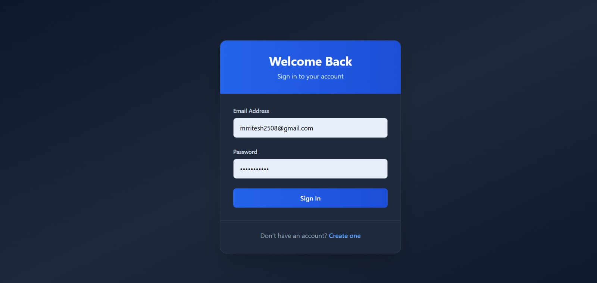
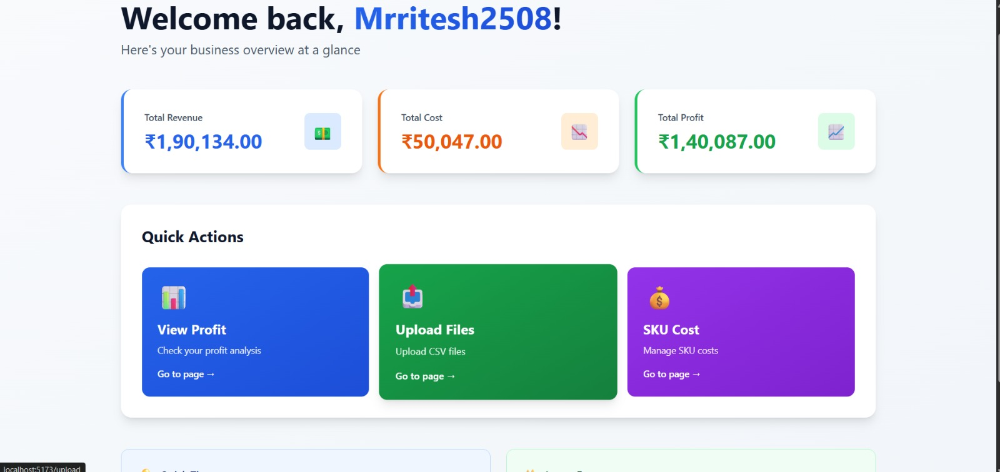
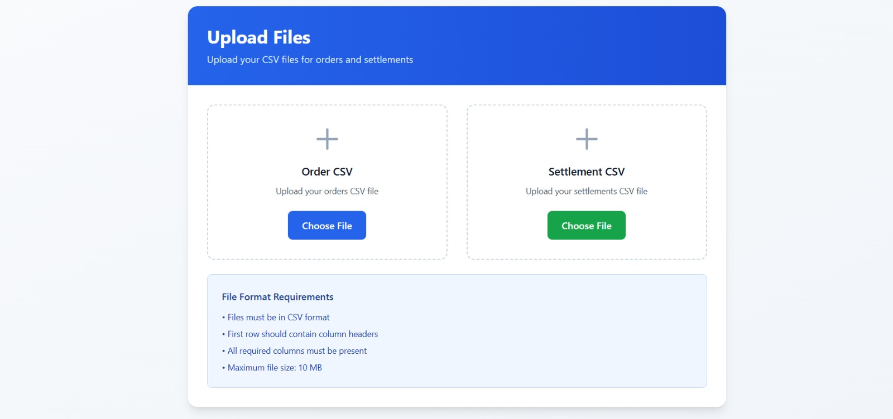
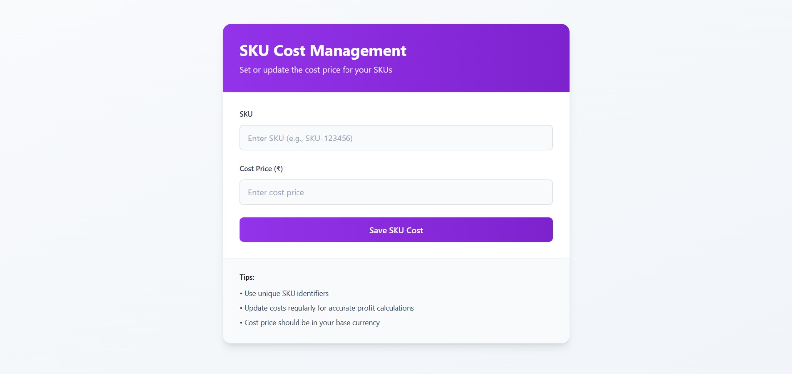
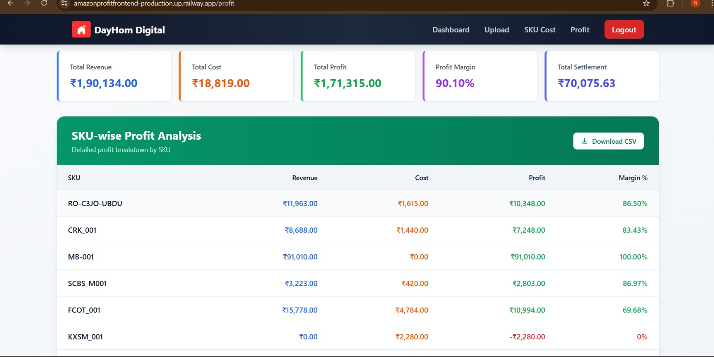

# Amazon-Profit-Tool-Demo

## Screenshots

🔥 Amazon Profit Analyzer – Backend (Spring Boot)
This backend service processes Amazon Order Reports and Settlement Reports to calculate:

Total Revenue

Total Cost (SKU-wise cost)

Total Profit

Profit Margin

SKU-wise Profit Breakdown

🛠 Tech Stack
-Java 17+

-Spring Boot

-Spring Security (JWT)

-MySQL

-JPA / Hibernate

-Maven

🔐 Authentication APIs
Register user --> POST /api/auth/register

Login & get JWT --> POST /api/auth/login

Upload Amazon Order CSV --> POST /api/upload/orders

Upload Amazon Settlement CSV --> POST /api/upload/settlement

🔒 Security Notes
JWT-based authentication

Stateless session

CORS enabled for frontend (localhost:5173)

🔄 How Profit Is Calculated
For each SKU:

Revenue = Sum(order item price)

Cost = quantity × cost_price

Profit = Revenue − Cost − Amazon Fees

Overall:

Total Profit = Total Revenue − Total Cost

Margin (%) = (Profit / Revenue) × 100

🧩 Architecture Overview

🏗 System Architecture
The system follows a modern full-stack architecture:

React frontend for user interaction

Spring Boot backend for business logic

JWT for authentication

MySQL for persistent storage

CSV/Excel parsers for Amazon reports

📊 Amazon Profit Analyzer – Frontend (React + Vite)
This frontend provides a dashboard UI to:

Login / Register

Upload Amazon CSV reports

Enter SKU costs

View profit analytics

🛠 Tech Stack
React (Vite)

JavaScript

Axios

React Router

Tailwind CSS

⚙️ Prerequisites
Node.js 18+

npm

Git

🔐 Pages Flow
Login / Register

Upload Order CSV

Upload Settlement CSV

Enter SKU cost

View Profit Dashboard
